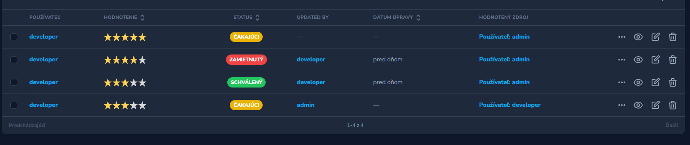

### Preview


### Usage

- register provider
```php
Wame\Review\ReviewServiceProvider::class,
```

- vendor publish   -- reviewServiceProvider
```php
php artisan vendor:publish --provider="Wame\Reviews\ReviewServiceProvider"
```

- add EventServiceProvieder for observer nad listeners

```php
   /**
     * The event to listener mappings for the application.
   */
 protected $listen = [
       ReviewCreatingEvent::class => [RunReviewCreatingListenerJob::class],
       ReviewUpdatingEvent::class => [RunReviewUpdatingListenerJob::class],
       ReviewUpdatedEvent::class => [RunReviewUpdatedListenerJob::class],
 ];
  /**
    * Register any events for your application.
   */
public function boot(): void
{
     Review::observe(ReviewObserver::class);
}
```

- add to Nova menu
```php
  MenuItem::resource(Review::class),
```

- set types Models <small>or edit label colors</small> in  `config/reviews.php `
```php
    'types' => [
        User::class,
        Order::class,
    ],
   'status_use' => true,
```
- edit translates  `resources/lang/sk/reviews.php `
```php
  "waiting" => "čakajúci",
  "approved" => "schválený",
  "denied" => "zamietnutý",
  "finished" => "hotové",
  "edit" => "upraviť",
```
